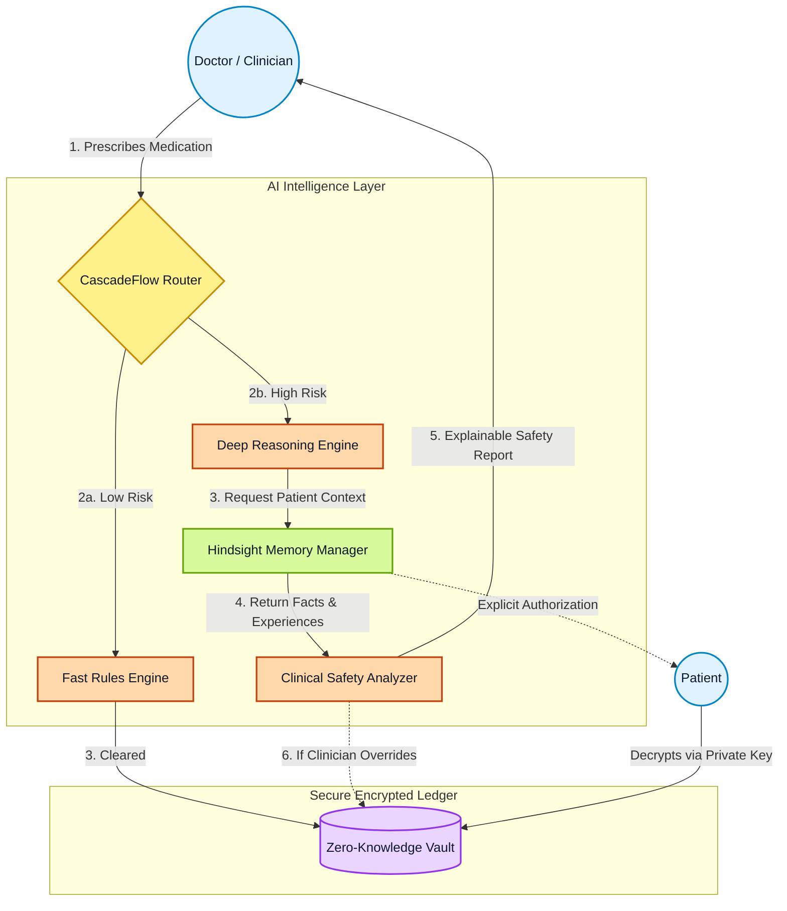

# 🛡️ MedSafe

> **A Patient-Owned Prescription Intelligence Platform**

MedSafe is a next-generation healthcare platform that merges **Zero-Knowledge Data Privacy** with **Intelligent Clinical Safety**. It acts as both a trusted digital health vault where patients own their data, and a clinical safety assistant that prevents pharmacological conflicts using dynamic AI routing.

---

## 🌟 Core Architecture & Features

### 1. 🔐 Cryptographic Patient Primacy
MedSafe is built on the principle that the patient is the absolute owner of their data. 
- **Zero-Knowledge Vault**: All medical records, prescriptions, and lab results are encrypted locally using the patient's public key.
- **Explicit Consent Ledger**: Doctors must explicitly request read-access, which the patient cryptographically signs and grants using their Private Key.
- **Instant Revocation**: Patients can instantly revoke access to their vault at any time, immediately locking out unauthorized entities.

### 2. 🌊 CascadeFlow AI Routing
Not every medical query requires deep, expensive language model reasoning. CascadeFlow acts as an intelligent traffic cop:
- **Low-Risk Queries** (e.g., standard painkillers) are instantly routed to a lightweight **Rules Engine** for minimal latency.
- **High-Risk Queries** (e.g., complex antibiotics or multi-drug interactions) are escalated to the **Deep Reasoning** track.

### 3. 🧠 Hindsight Structured Memory
Instead of passing unstructured context to an LLM, MedSafe categorizes long-term patient memory into a strict schema:
- **Facts**: Verified allergies (e.g., Penicillin) and blood types.
- **Experiences**: Past prescriptions and reported adverse reactions.
- **Beliefs**: Tentative AI inferences waiting for clinical confirmation.

---

## 🏗️ System Workflow

The following architecture diagram illustrates how the AI Intelligence Layer intercepts and secures prescriptions.



---

## 🚀 Getting Started

### Prerequisites
- Node.js (v18 or higher)
- npm or yarn

### Installation
1. **Clone the repository**
   ```bash
   git clone https://github.com/Akshaya-csbs/MedSafe.git
   cd MedSafe
   ```

2. **Install dependencies**
   ```bash
   npm install
   ```

3. **Start the Development Server**
   ```bash
   npm run dev
   ```

4. **Access the platform**
   Open your browser and navigate to `http://localhost:3000`.

---

## 💻 Tech Stack
- **Frontend**: React 18, TypeScript, TailwindCSS, Lucide Icons
- **Build Tool**: Vite
- **AI Mock Architecture**: In-memory Object-Oriented specialized services (`CascadeRouter`, `SafetyAnalyzer`, `HindsightMemory`) simulating production latency and logic.
- **Crypto Engine**: Simulated RSA-256 and AES client-side asymmetric handshakes (`cryptoSim.ts`).

---

<div align="center">
  <i>Built with absolute prioritization for patient safety and data sovereignty.</i>
</div>
